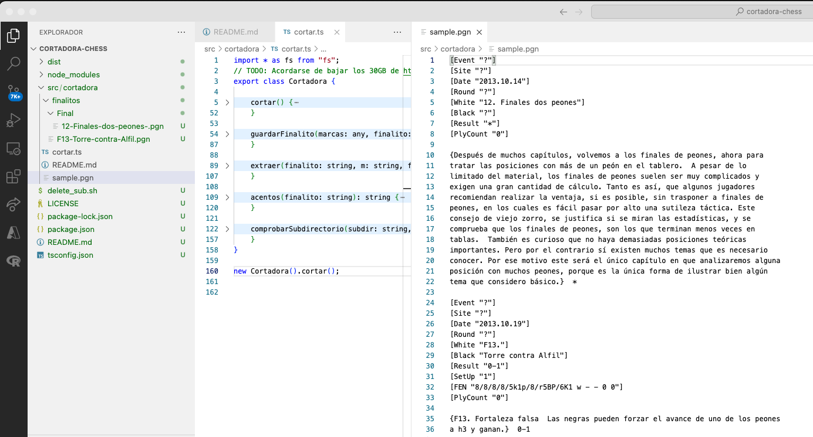

# ¿Qué la Cortadora?

Le pasas un archivo pgn con miles de eventos y te crea una biblioteca con un pgn por partida. En verdad, es una semillita para que cada uno pueda montarse sus propios "cortes". :-D

En la imagen se aprecia el proceso: -

- (a la derecha de la imagen) la cortadora toma el archivo [sample.pgn](./sample.pgn) que contiene 2 partidas,
- (en el árbol de la izquierda) ... y corta al directorio [src/cortadora/finalitos](./finalitos/), detectando, en este caso, la sección [Final](./finalitos/Final/) creando un subdirectorio.


# ¿Cómo configuro?

Tienes que indicarle el directorio y el nombre del archivo pgn; además de indicarle a partir de qué directorio quieres crear la biblioteca.

```ts
export class Cortadora {

    /* ... */

    const salida = `${__dirname}/finalitos/`;
    const entrada = `${__dirname}/sample.pgn`;
```

Puedes decirle, qué secciones crear, a partir del contenido del pgn:

```ts
export class Cortadora {

    /* ... */

    const marcas = {
        Evento: "[Event ",
        Blancas: "[White ",
        Negras: "[Black ",
        Fin:"]",
        Vacia: "  ",
        Diagrama: "Diag",
        Solucion: "Solucion",
        Seccion: "Seccion",
        Resumen: "Resumen",
        Final: "Final"
    }
```

Una app nodejs normal, antes de ejecutar la primera vez hay que bajar de npmjs.com los paquetes.

```

npm install

```

# ¿Cómo lanzo la Cortadora?

Una app nodejs normal.

```

npm run cortadora

```