¡LA LICHESSADORA FUNCIONA (un manitas digital avispado la pone en marcha), PERO NO ES FUNCIONAL (falta meter engranajes ahí), TODAVÍA!! :-D NOVIEMBRE 2023 WAIT FOR IT!!!!!


- ¿Qué la Lichesseadora?
- ¿Cómo se construye la Lichesseadora?
    - La API Lichess Studio
- ¿Cómo configuro?
- ¿Cómo lanzo la Lichesseadora?

# ¿Qué la Lichesseadora?

Advertencia preliminar:

Esta utilidad no tiene por objeto gestionar archivos pgn sino interactuar con el servidor. Con especialidad en **"crear estudios"** a partir de partidas. En ese sentido, se recuerda que para manejar archivos estará la PGNeadora (wip). Y que para pngs están:

Download all Lichess rated games:
- https://database.lichess.org/

Download all Lichess puzzles with themes, ratings and votes:
- https://database.lichess.org/#puzzles

Esta utilidad se abraza a: https://lichess.org/api.

Hay dos 2 vías de ataque:

La new: https://github.com/lichess-org/api-ui

Y old: https://github.com/lichess-org/api-demo

El objetivo de esta utilidad se interesará por la posibilidad de "**Crear [estudios de lichess](https://lichess.org/study) a partir de [La Cortadora](../cortadora)**", caso de que Lichess provea esa API.

# ¿Cómo se construye la Lichesseadora?

Se intentará no hacer cosas raras y obtener el "lichesseado" lo más transparente posible, de cara y con el objeto de presentar una utilidad "transparente" que permita lichessear sin cosas raras en medio.

Por tanto, procedemos formalmente, lo típico sin salirse del paradigma:

```
mkdir lichesseadora
cd lichesseadora
git clone https://github.com/lichess-org/api-demo.git
cd api-demo
rm -r .git
rm .github
cd ..
mv api-demo lichesseador
cd lichesseador
npm install
npm run build
npm run serve
```

Tras lo que, sin problemas, debería proveernos la app-demo de lichess:

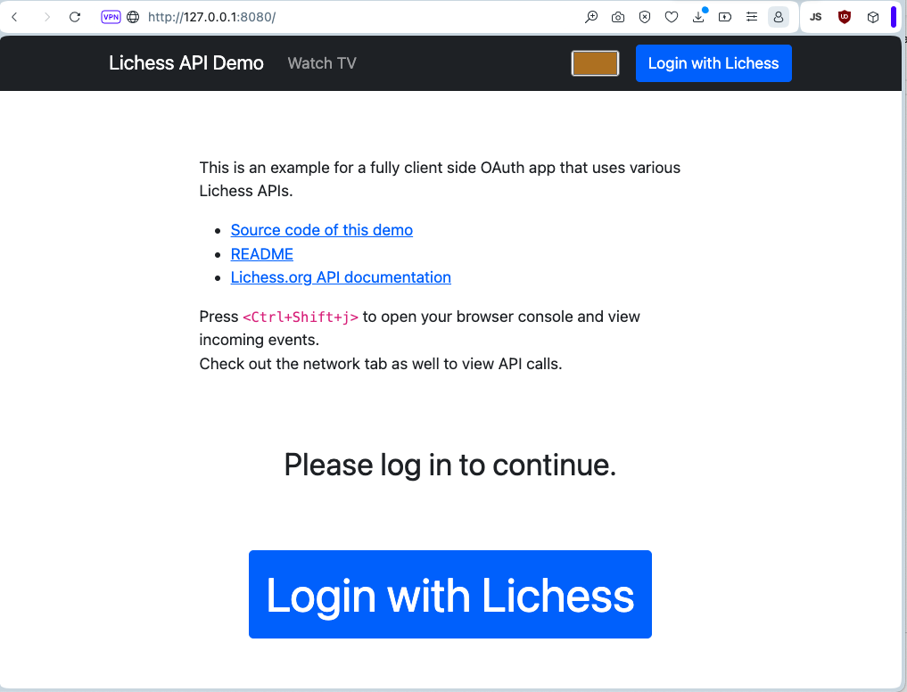

Rápidamente, porque nuestro objetivo es la **API de Estudio**, pulsamos: "Login with Lichess" vemos que la demo trae petición de la **API-tablero** y el propio lichess nos informa de la url de nuestro licheseador, la dirección local, en este caso: 127.0.0.1, podemos, pues, autorizar con tranquilidad:

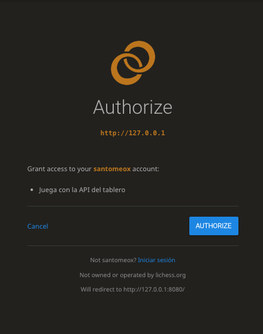

Lo que, en principio, nos conduce a la portada de la app, en un estado "autorizado" que permitirá lichessear agusto. ¿Estará entre las opciones que se nos ofrecen la posibilidad de "conectar La Cortadora de PNGs a la API Estudio"?

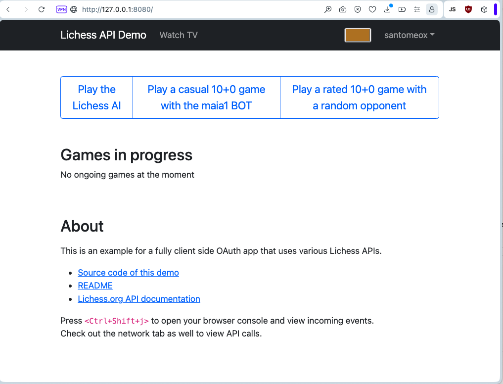

Vemos en pantalla (arriba) un texto en rosa, que llama la atención, ¿no? Hacemos lo que nos dice, o, si no funciona, buscamos cómo abrir las "herramientas de desarrollador" en nuestro navegador; y vemos que como no estamos jugando no hay mensajes.

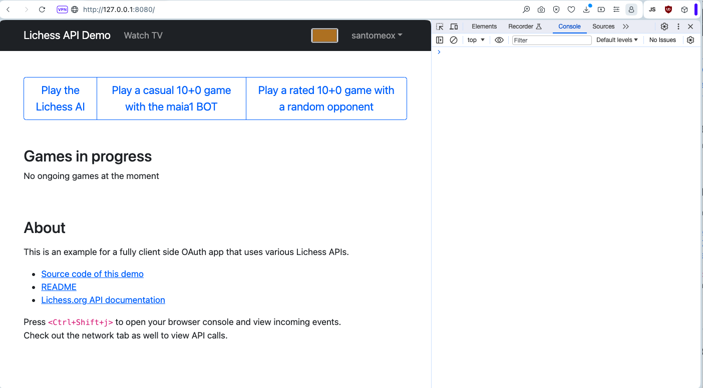

Y que si empezamos a jugar, habrán mensajes:

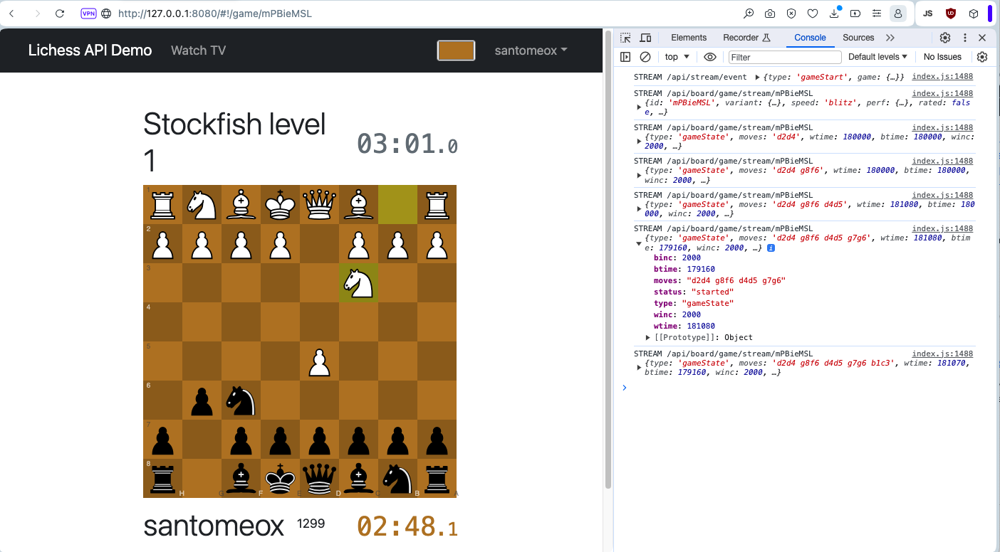

En cualquier caso, está claro que **la API-tablero funciona correctamente y que tenemos comunicación con lichess**, por la evidencia empírica de que hemos visto los mensajes.

¿Significa eso que nuestro lichesseador está preparado para unirse a la Cortadora y subir los finalitos o cualquier otra colección pgn a estudios de lichess?

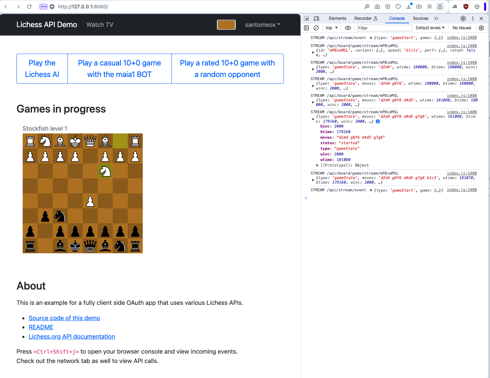

En absoluto, ¿existe esa API?)

# La API Lichess Studio

¡¡Caramba!! ¡¡Sí que existe nuestra anhelada API Studio!!!

- https://lichess.org/api#tag/Studies

Vale, pues ahora, ya, para el objetivo, ¿existe la posibilidad de "¿crear studio desde png?"

¡¡Eureka, sí que existe!!

- https://lichess.org/api#tag/Studies/operation/apiStudyImportPGN

¡¡Vamos a consumirlo!! Wait, cómo? o sea, [La Cortada](../cortadora/) tiene un [sample.pgn](../cortadora/sample.pgn) ya cortado, en su carpeta [Cortadora/finalitos](../cortadora/finalitos/):

- [finalitos/F13-Torre-contra-Alfil.pgn](../cortadora/finalitos/F13-Torre-contra-Alfil.pgn)
- [finalitos/Final/12-Finales-dos-peones-.pgn](../cortadora/finalitos/Final/12-Finales-dos-peones-.pgn)

¿Consumimos el punto de entrada apiStudyImportPGN? ¿Vemos si se puede?

Para ello, lo normal, sin florituras:

- Una [cajita en la portada](./lichesseador/src/view/cortadora.ts) para que nos enseñe los pgn que La Cortadora tiene preparados.
- Saber [qué estudios tenemos creados](https://lichess.org/api#tag/Studies/operation/studyListMetadata)

As per la docu, parece que para acceder a la lista de estudios en lichess hay que [agregar el "study:read" scope](./lichesseador/src/auth.ts). Para que los nuevos scopes funcionen hay que desloguear y volver a loguear sino:

```json
{ "error":"Missing scope" }
``````

En el método fetchBody de [auth](./lichesseador/src/auth.ts) he tenido que cambiar la conversión de la respuesta de lichess desde viene como un objeto array sin corchetes ni comas, :-D. Me pregunto, por qué.

Al final con un poco de currete montamos una lista. 

El tema, para funcionar con [la Cortadora](../cortadora/finalitos/) será, por lo fácil, dummy, que, pongamos, mostramos en la lista todos los pngs que haya en un directorio.

Se escoge un estudio y ¡subir!

Ya se pondrán otras virguerías. Por ejemplo, ahora, para el caso, como dije arriba, le tengo puesto el directorio de ejemplo de la cortadora.

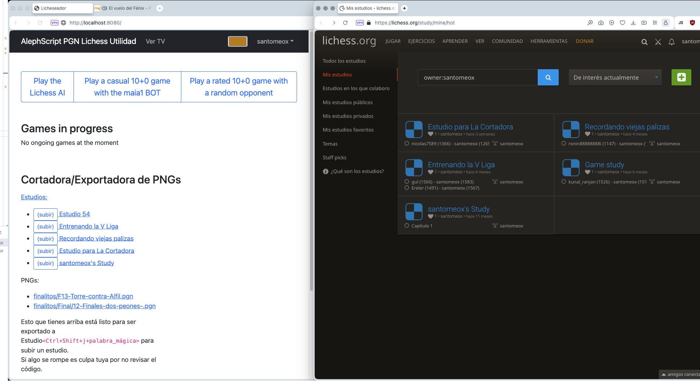

Vale, pues, entonces, ahora solo falta que al darle click pregunte. Y, si sí, que se suban los pngs. Usando el [método molón de la API importPNGS](https://lichess.org/api#tag/Studies/operation/apiStudyImportPGN).

No sé muy bien cuánto aguantará la API, si se puede subir de uno en uno o a lotes. Si acaso, mejor, enviamos 1 y luego enviamos otros, y así... todo lo pongo en el [Chanel.Studio](./lichesseador/src/chanels/studio.ts).

De momento pongo diálogo básico clásico y, si el usuario le da a aceptar, ponga a [La Lichessadora](.) a subir pngs hasta que acabe con la lista. Creo que pondré un tope... :-D

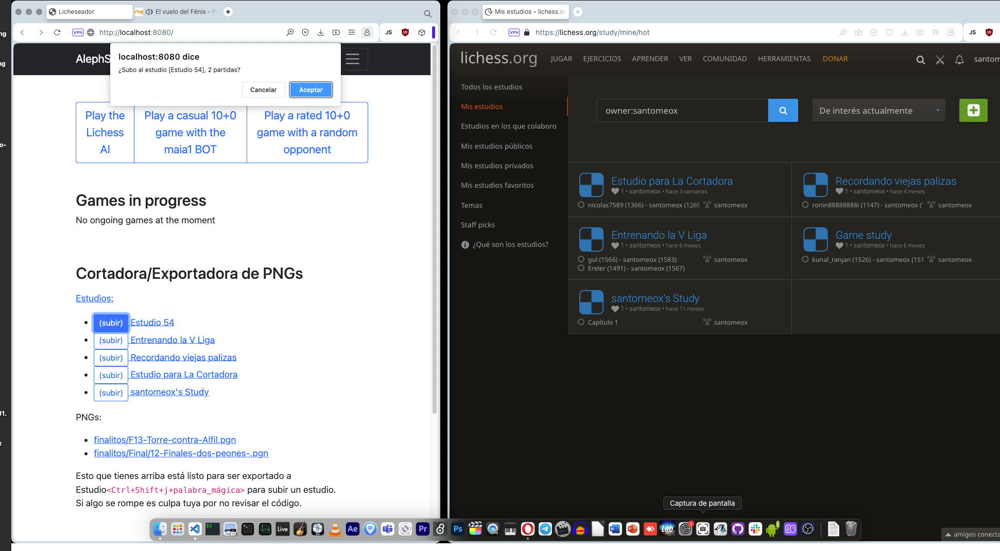

¡¡Ojo que para subir pgns al studio necesitamos ampliar el scope con: **study:write**!!!

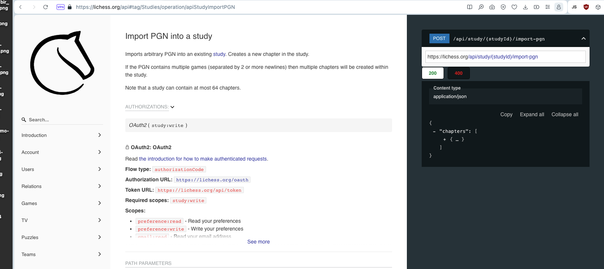

Finalmente, como decimos, implementamos la llamada a la API. Pulsamos el botón **subir**, y...

Petición:

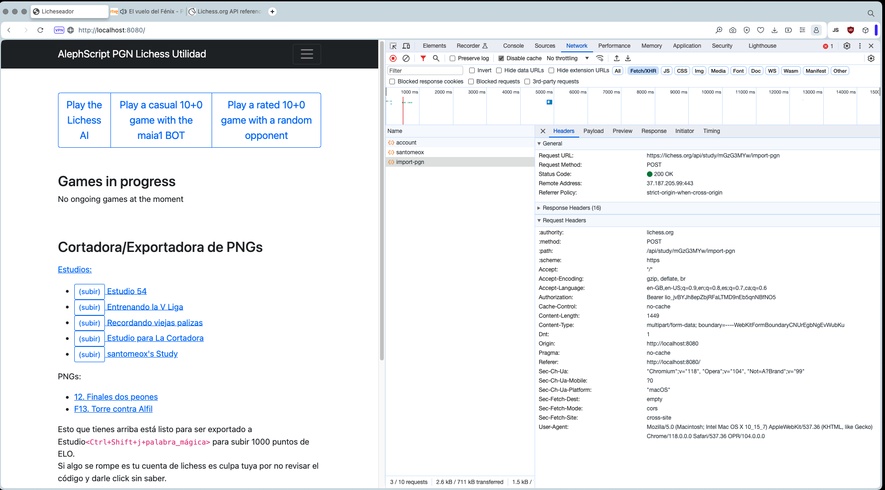

Carga de datos:

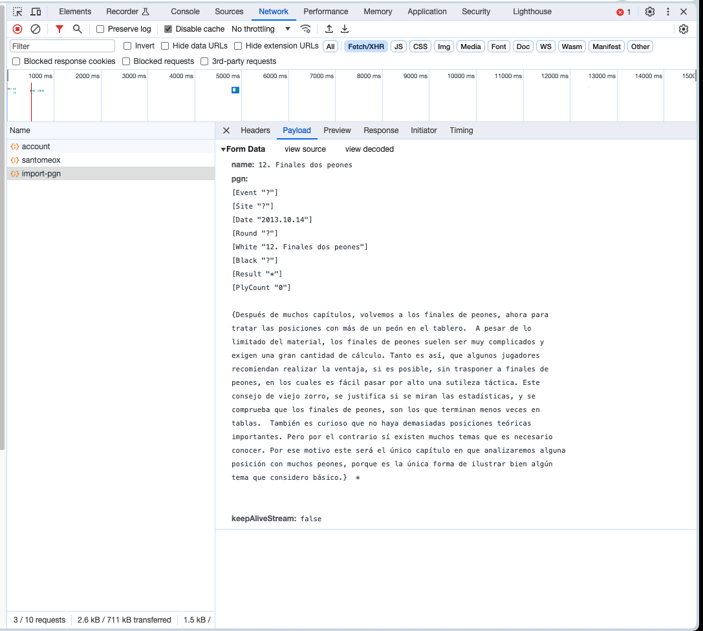

Vista previa:

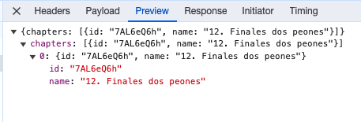

¡¡Comprobamos!!

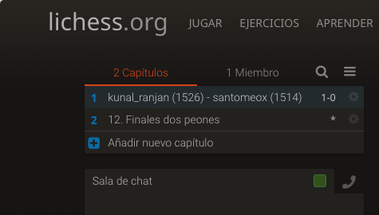

# ¿Cómo configuro?

Una app nodejs normal, antes∏de ejecutar la primera vez hay que bajar de npmjs.com los paquetes.

```

npm install

```

# ¿Cómo lanzo la Lichesseadora?

Una app nodejs normal.

```

npm run lichesseadora

```